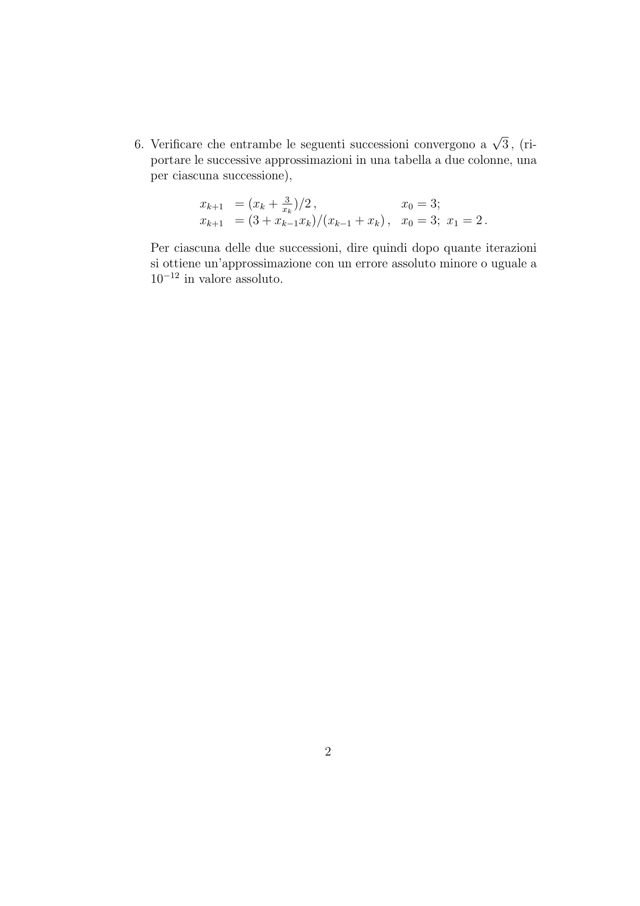
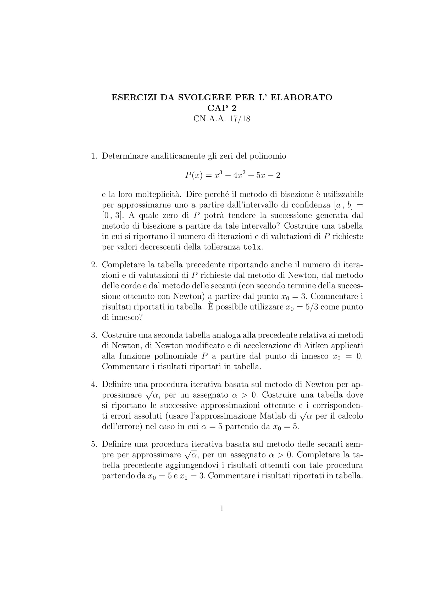
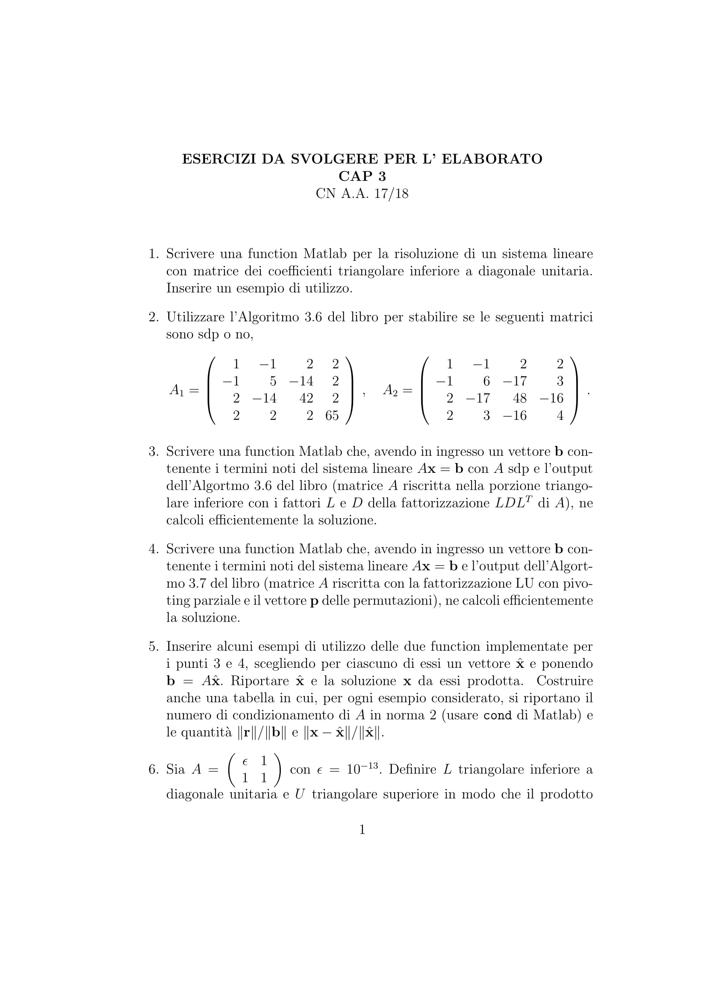
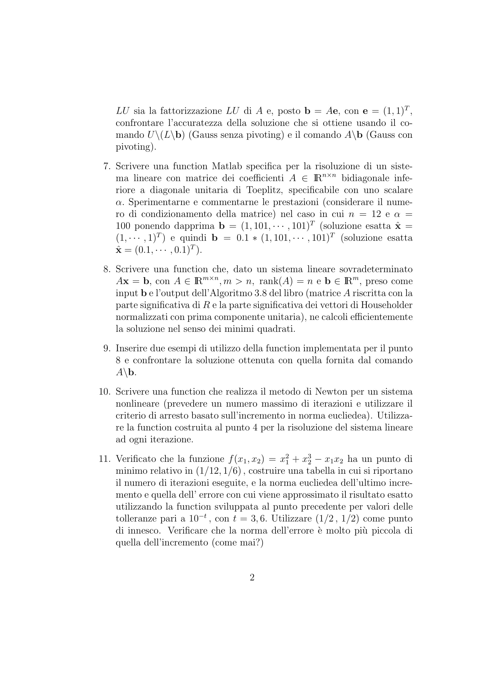

# Elaborato CN - aa 2017/2018

| Es n° | Capitolo1 |
| ----- | --------- |
| 1     | ✔         |
| 2     | ✗         |
| 3     | ✔         |
| 4     | ✔         |
| 5     | ✔         |
| 6     | ✔         |

| Es n° | Capitolo2                   |
| ----- | --------------------------- |
| 1     | ✔ (rispondere alla domanda) |
| 2     | ✔ (ultima domanda?)         |
| 3     | ✔                           |
| 4     | ✔                           |
| 5     | ✔                           |

| Es n° | Capitolo3          |
| ----- | ------------------ |
| 1     | ✔                  |
| 2     | ✔                  |
| 3     | ✔                  |
| 4     | ✔                  |
| 5     | ✔ (controllare)    |
| 6     | ✔  (controllare)   |
| 7     | ✗                  |
| 8     | ✔                  |
| 9     | ✔ (conrollo)       |
| 10    | ✔  (controllo)     |
| 11  | ✔ (manca norma errore e domanda, controllo)|
