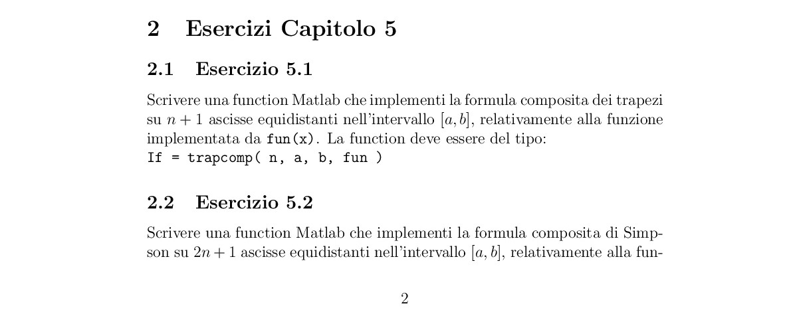

# Elaborato CN - 2017/2018

## Capitolo 1

| Es n° | Stato |
| ----- | ----- |
| 1     | ✔     |
| 2     | ✔     |
| 3     | ✔     |
| 4     | ✔     |
| 5     | ✔     |
| 6     | ✔     |

## Capitolo 2

| Es n° | Stato |
| ----- | ----- |
| 1     | ✔     |
| 2     | ✔     |
| 3     | ✔     |
| 4     | ✔     |
| 5     | ✔     |

## Capitolo 3

| Es n° | Stato |
| ----- | ----- |
| 1     | ✔     |
| 2     | ✔     |
| 3     | ✔     |
| 4     | ✔     |
| 5     | ✔     |
| 6     | ✔     |
| 7     | ✔     |
| 8     | ✔     |
| 9     | ✔     |
| 10    | ✔     |
| 11    | ✔     |

## Capitolo 4

| Es n° | Stato |
| ----- | ----- |
| 1     | X |
| 2     | X|
| 3     | X |
| 4     | X |
| 5     | X |
| 6     | X|
| 7     | X|
| 8     | X|
| 9     | X|
| 10    | X|

## Capitolo 5

| Es n° | Stato |
| ----- | ----- |
| 1     | X |
| 2     | X|
| 3     | X |
| 4     | X |
| 5     | X |

## Capitolo 6
