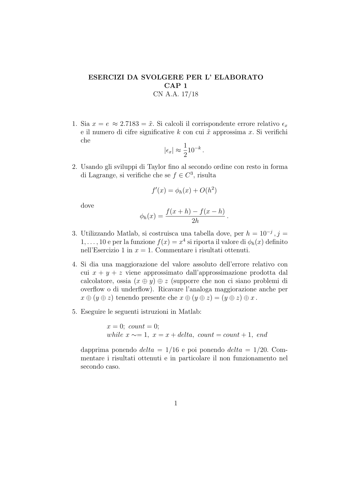
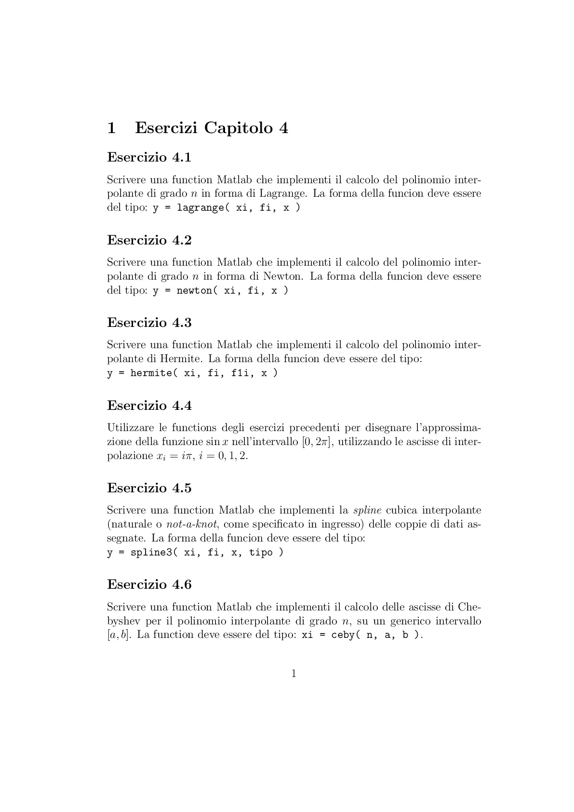

# Elaborato CN - 2017/2018

## Capitolo 1

| Es n° | Stato |
| ----- | ----- |
| 1     | ✔     |
| 2     | ✔     |
| 3     | ✔     |
| 4     | ✔     |
| 5     | ✔     |
| 6     | ✔     |

## Capitolo 2

| Es n° | Stato                       |
| ----- | --------------------------- |
| 1     | ✔ (rispondere alla domanda) |
| 2     | ✔ (ultima domanda?)         |
| 3     | ✔                           |
| 4     | ✔                           |
| 5     | ✔                           |

## Capitolo 3

| Es n° | Stato                                       |
| ----- | ------------------------------------------- |
| 1     | ✔                                           |
| 2     | ✔                                           |
| 3     | ✔                                           |
| 4     | ✔                                           |
| 5     | ✔ (controllare)                             |
| 6     | ✔ (controllare)                             |
| 7     | ✔                                           |
| 8     | ✔                                           |
| 9     | ✔                                           |
| 10    | ✔ (controllo)                               |
| 11    | ✔ (manca norma errore e domanda, controllo) |

## Capitolo 4

| Es n° | Stato |
| ----- | ----- |
| 1     | X     |
| 2     | X     |
| 3     | X     |
| 4     | X     |
| 5     | X     |
| 6     | X     |
